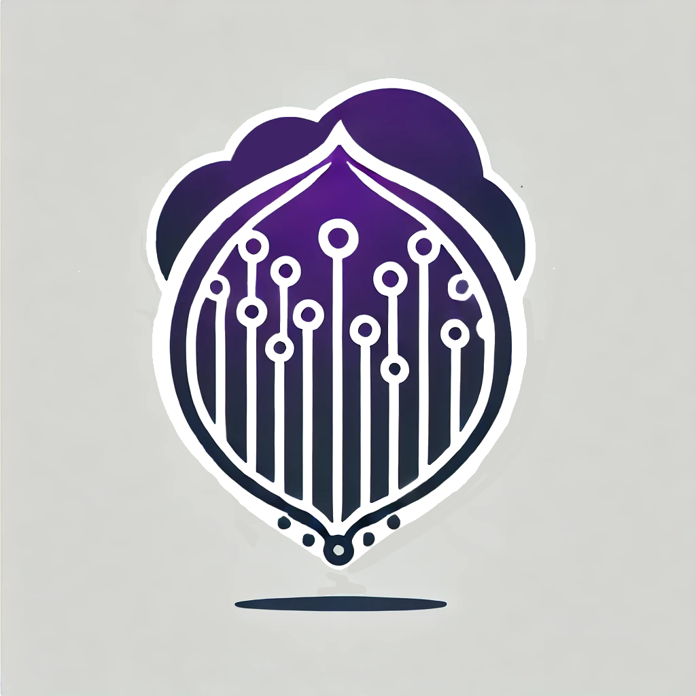

<div style="text-align: center;">
  
</div>

# 🌐 Welcome to **Anonymous Shard**

> A decentralized and anonymous system to ensure privacy and security.  
> In this guide, you will explore the project's foundations, how to set it up, and how to contribute. Thanks :D 

---

## 🚀 Introduction

This project aims to create a **completely anonymous** P2P network leveraging **Tor**, ensuring every participant remains anonymous, while the system is decentralized with no central authority.
The goal is to support different kind of task execution, such as **file sharing**, **computational tasks**, and **data storage**.

For now, the project is designed to be easily extensible, allowing multiple types of Task Executors to be implemented. 
The current implementation is focused on easy **Sum** tasks. 

### **Key Points:**
- **Tor**: Anonymity via the Tor network.
- **IPFS**: Decentralized storage and content distribution.
- **DHT**: Distributed Hash Table for P2P communication.
- **SOCKS5**: Proxy protocol for Tor communication.
- **Docker**: Containerization for easy deployment.

---

## 🌟 Main Features

- **Anonymous Nodes**: Every node operates as a **Tor hidden service** to ensure anonymity.
- **Complete Autonomy**: Nodes autonomously join the network without predefined configurations, exploiting **DHT** for discovery.
- **Decentralized Storage**: **IPFS** is used for decentralized storage and content distribution.
- **Encryption**: All communications are encrypted by default and use **Tor** for anonymity, same for tasks results.
- **Decentralized Management**: There are no single points of failure. The network is fully distributed.

## 🌟 Understanding the Project

- **Provider**: A node that provides resources to the network, such as CPU, storage, and bandwidth that can execute tasks.
- **Consumer**: A node that requests tasks to be executed.
- **Task**: A task is a job that needs to be executed by one node.
- **Task Result**: The result of a task execution, encrypted, stored securely on IPFS.
- **Task Executor**: A component that executes tasks on a node, different types of executors can be implemented (composing the **Capabilities** of a provider node).
- **Task Evaluator**: A component that establish if the task is runnable on a provider node.
- **Selection Algorithm**: A mechanism to select the best provider for a task, for now simply based on available metrics. 

---

## Anonymity mode

- **Anonymous** 🟢: Transport layer based on **Tor**.
- **Non-Anonymous** 🔴: Transport layer based on **TCP**, exposing the real IP address.

## 🌟 Future Features

- **Next Secure Rewards**: Users are rewarded in **Monero** for maintaining the network.
- **Supporter Node**: Nodes can be configured to support the network by providing additional resources, getting rewarded. 
- **Task Executor**: Support for different types of tasks, such as **file sharing**.
- **Task Scheduler**: A scheduler to manage tasks and distribute them to nodes.
- **Optimized Provider Selection**: A mechanism to select the best provider for a task, exploiting **Supporters**. 
---

## 🛠️ Project Setup

### Requisites
- **Docker**: To run the project in a containerized environment.

### 1. **Clone the Repository**
To get started, clone the project to your machine:

```bash
git clone https://github.com/paga16-hash/anonymous-shard.git
```

### 2. **Running the Project**

Navigate to the project directory and run the following command:

```bash
./start.sh providers=NUM_PROVIDER consumers=NUM_CONSUMER
```
It will trigger a docker-compose command to start the project, after generating the necessary configuration files.
Replace `NUM_PROVIDER` and `NUM_CONSUMER` with the desired number of providers and consumers.

### 3. **Accessing the Dashboard**
Opening the browser and navigating to `http://localhost:8080` will display the dashboard.
Every node has a unique frontend, 
and it can be accessible only by the node itself, 
in this case, for development, the dashboard is accessible by the host exploiting the docker port mapping.

- To simulate a task submission, click the `Submit Task` button from a consumer node frontend.
---


