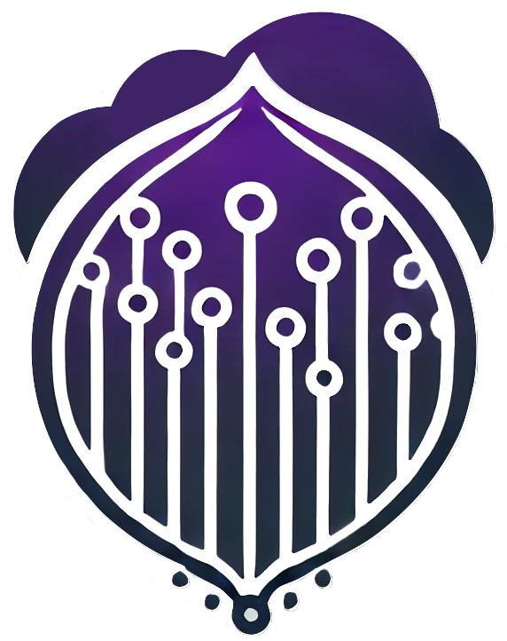

# 

# 🌐 Welcome to **Anonymous Shard**

> A decentralized and anonymous system to ensure privacy and security.  
> In this guide, you will explore the project's foundations, how to set it up, and how to contribute. Thanks :D 

---

## 🚀 Introduction

This project aims to create a **completely anonymous** P2P network leveraging **Tor**, ensuring every participant remains anonymous, while the system is decentralized with no central authority.

### **Key Technologies:**
- **Tor**: Anonymity via the Tor network.
- **Monero**: For the anonymous reward system.

---

## 🌟 Main Features

- **Anonymous Nodes**: Every node operates as a **Tor hidden service** to ensure anonymity.
- **Complete Autonomy**: Nodes autonomously join the network without predefined configurations.
- **Next Secure Rewards**: Users are rewarded in **Monero** for maintaining the network.
- **Decentralized Management**: There are no single points of failure. The network is fully distributed.

---

## 🛠️ Project Setup

### 1. **Clone the Repository**
To get started, clone the project to your machine:

```bash
git clone https://github.com/paga16-hash/anonymous-shard.git
```
