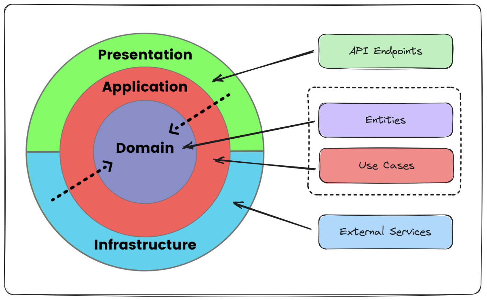
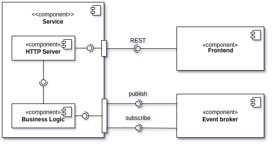
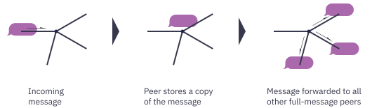

# Architecture

The system consists of nodes with various components that interact to deliver the described functionalities. The design follows **Clean Architecture** principles [Martin, 2017], promoting independence from frameworks and libraries. This methodology separates the system into layers, each responsible for specific tasks, ensuring modularity and flexibility.

*Figure 1: Clean Architecture*

This architecture emphasizes the separation of concerns and follows the *Dependency Inversion Principle (DIP)* [Martin, 1996], facilitating a robust and maintainable system design.

## Components

*Figure 2: Components and connectors*

Nodes in the system have different components based on their roles. Provider and consumer nodes share some components but differ in responsibilities.

### Provider Node Components

Provider nodes have three key services: **Discovery Service**, **Metric Service**, and **Task Service**. These services are managed by the **Node Service**, which coordinates with them to perform tasks. Connectors include the **Event Broker**, **Repository Connector** (for IPFS storage), and **REST API** for internal monitoring.

### Consumer Node Components

Consumer nodes have a simpler structure, omitting the **Discovery Service** and **Metric Service**, as they are not needed. The **Node Service** interacts with the network using the **Task Service** to handle task submissions and result retrieval, and the **Event Broker** facilitates network interactions.

### Event Broker

The Event Broker in a decentralized system represents a challenging component. Gossip-based publish-subscribe is the decentralized messaging paradigm used, which leverages gossip protocols for disseminating events across a network [Vyzovitis, 2020]. Unlike traditional broker-based pub-sub systems, where a central broker manages subscriptions and message delivery, gossip-based pub-sub distributes messages in a Peer-to-Peer (P2P) fashion. Nodes periodically exchange information with a subset of their peers, ensuring that events propagate throughout the network in an eventually consistent manner. This approach enhances fault tolerance, scalability, and resilience against failures, making it well-suited for large-scale distributed systems. However, redundant message transmission combined with high-latency networks like Tor introduces challenges compared to structured pub-sub models.

*Figure 3: Gossip Pub-Sub Mechanism*

## Other Considered Alternatives

While the **Event-Driven Model** was chosen for the system, other alternatives, particularly the **Actor Model**, were evaluated. The Actor Model aligns well with the system’s requirements but was considered complex and had a steep learning curve, which might hinder rapid prototyping and adoption by the developer community. Additionally, the **Event-Driven Model** was preferred due to its **Loose Coupling** and **Flexibility**, whereas the Actor Model tends to be **Tightly Coupled**, requiring direct communication between actors and introducing dependencies that reduce the system's scalability.

From an **ecosystem perspective**, the **Event-Driven Model** was preferred due to the following key advantages:

1. **Loose Coupling & Flexibility**: Components remain independent, making modifications and integrations easier.
2. **Stateless and Scalable by Design**: Enables effortless scaling.
3. **Lower Learning Curve**: More accessible to developers familiar with standard messaging protocols.
4. **Better for Asynchronous Workflows**: Naturally integrates with async/await patterns and reactive programming.

The **Actor Model** remains a powerful alternative, offering fault tolerance and resilient state management.
