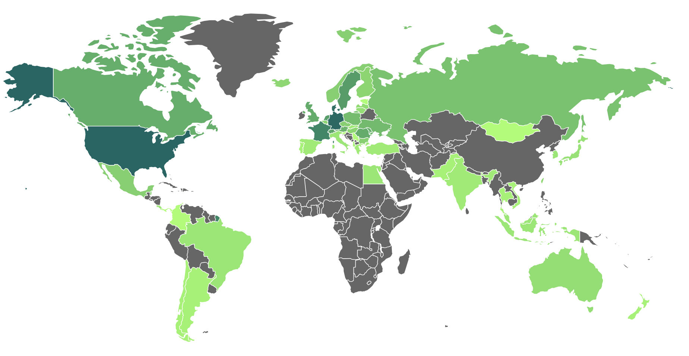

# Implementation

From the detailed design section, the system exploits a lot of interfaces fixing the business logic and the separation of concerns also before the real implementation. One of the principles that have been followed is the **Dependency Inversion Principle** that is a key principle of the Clean Architecture.

It is a concept in software design that helps keep different parts of a system loosely coupled. It states that high-level modules (which define business logic) should not directly depend on low-level modules (such as databases or network connections). Instead, both should rely on abstractions.

Improving **flexibility** and **maintainability** without impacting the core logic. Another pro is that this principle makes it easier to test the codebase as it allows for the use of mock objects to simulate dependencies during testing, a feature that is particularly useful in possible future testing phases.

## Technologies

### Programming Language

The programming language chosen for the implementation is **TypeScript**, a superset of JavaScript that adds static typing to the language. This choice has been made to ensure a more robust codebase and to leverage the benefits of static typing during the development phase. Moreover, TypeScript is widely used in the industry and has a large community, making it easier to find resources and support, especially for a project that aims to be open-source.

Some cons of TypeScript are the learning curve and the compilation time that can be longer than JavaScript, but the benefits in terms of code quality and maintainability outweigh the cons. In this case, I was also familiar with TypeScript, so the choice was natural. This choice is not a constraint for the possible creation of other typologies of nodes because once the interfaces and communication patterns are defined, the implementation can be done in any language.

### Express

**[Express](https://expressjs.com/)** is a minimal and flexible Node.js web application framework that provides a robust set of features for web apps. In this project, Express is used to create the REST API layer that exposes the system monitoring functionalities to the user. The choice of Express was made because of its simplicity, making it ideal but not for any particular constraint.

### Tor

**[Tor](https://www.torproject.org/)** (The Onion Router) is a privacy-focused network that enables anonymous communication by routing traffic through a series of encrypted relays. It adds an extra layer of security by encrypting data multiple times, ensuring that the data inside the network remains hidden. In this system, Tor is used to anonymize communications between nodes, ensuring that the identity and location of participants remain undisclosed. Tor offers **Hidden Services** that allow services to be hosted on the tor network. The choice of Tor was made due to its strong anonymity guarantees.

An **[Hidden Service](https://tb-manual.torproject.org/onion-services/)** is a service that is only accessible through the Tor network. It is a server that is configured to receive inbound connections only through the Tor network, ensuring that the server's location remains hidden.

It offers a series of advantages that are fundamental for this system:

1. **Anonymity:** The IP address of an onion service remains hidden, protecting both users and operators.
2. **Encryption:** All traffic between users and the onion service is encrypted at the network level. However, it is important to note that this encryption applies only to the transport layer within the Tor network. In general, once the data reaches the onion service, its security depends on how the service processes and stores it. If the service does not implement additional encryption or security mechanisms, sensitive information could still be exposed or vulnerable to attacks on the server side.
3. **Automatic Address Generation:** Users do not need to buy domain names; onion addresses are cryptographically generated.
4. **Integrity Assurance:** The .onion URL itself ensures users connect to the correct service without risk of tampering.

To access an onion service, users must know its .onion address, which consists of 56 alphanumeric characters followed by `.onion`. Additionally, websites can implement the `Onion-Location` header, allowing automatic redirection to their onion counterpart.

A possible enhancement involves authenticated onion services, which require users to provide an authentication token before gaining access. This strengthens security by restricting access to authorized users only. Tor Browser supports this mechanism, allowing users to enter a private key when prompted.

An encountered problem while the containerization process of the system inherent to how Hidden Services are managed by Tor can be found in the Deployment Chapter.

**[Entry Nodes](https://support.torproject.org/about/entry-guards/)** (or **Guard Nodes**) are the first relay point your traffic passes through when connecting to Tor. They are responsible for establishing the connection between your device and the Tor network, providing anonymity by masking your real IP address.

**[Exit Nodes](https://blog.torproject.org/tips-running-exit-node/)** are the last relay in the Tor network that your traffic passes through before reaching its final destination. They are responsible for sending the encrypted traffic and decrypting the final layer of encryption. However, the exit node can see your traffic’s destination but not its source (IP address). An updated list of the Tor Relays and a lot of interesting metrics can be found [here](https://metrics.torproject.org/rs.html).


*Figure: Mapped Exit node*

### IPFS

**[IPFS](https://ipfs.tech/)** (InterPlanetary File System) is a distributed, peer-to-peer network for storing and sharing data in a decentralized manner. Instead of relying on a central server, IPFS uses content-addressing, where each file is identified by its cryptographic hash, ensuring immutability and resistance to censorship. In this system, it is used to store and retrieve data efficiently avoiding reliance on centralized storage solutions. This choice was made because of its decentralized architecture and data persistence.

The problem encountered here is that, as mentioned, this technology exploits content-addressing, so once the data are stored on IPFS they become immutable. Moreover, the stored data are not encrypted by default, so it is necessary to encrypt them before storing to ensure privacy and confidentiality. In this system, it is used to persist the info about tasks and tasks results. The design choice to avoid the storage of clear data on IPFS is the generation of a key pair by the consumer node that is used to encrypt the result before the storage. Mechanism deepened in Security Pattern Section.

#### Pinata

Pinata is a cloud-based service that simplifies storing and managing files on IPFS (InterPlanetary File System). It has been used for simplicity and to avoid the need to run a self-hosted IPFS node, considered time-consuming for a prototype. It provides a web interface, API access, and pinning services and some technical documentation that helps the developing process.

Unlike self-hosted IPFS nodes, Pinata is ideal for those who don't want to maintain their own infrastructure. In this case, besides the fact that the system is a prototype and a self-hosted IPFS node would be excessive, it was very interesting to understand how it works. This technology is widely used in NFTs, Web3 applications, and decentralized storage solutions, offering scalability, access control, and analytics.

Beyond this, however, the main purpose of the system would require one or more independent nodes to maintain the system decentralized.

### SOCKS5 Proxy

**[SOCKS5](https://support.torproject.org/glossary/socks5/)** is a networking protocol that routes network packets between a client and a server through a proxy server. In this system, every communication is tunneled through a SOCKS5 proxy to ensure anonymity and privacy when *Anonymous Mode* is enabled. As mentioned in the Background Section, the choice of SOCKS5 was made because of the Tor network's support for this protocol, making it ideal for routing network traffic through that network. Moreover, this type of proxy supports various protocols, and with this fifth version, also the UDP, that is a nice feature. The problem is that the UDP protocol is not supported by the Tor network, so it is not used in this system.

Briefly, this proxy mechanism is very powerful; it allows the system to transparently route packets through an intermediate relay, preserving anonymity while maintaining efficient communication.

General key advantages of using this proxy include:

1. **Anonymity and Privacy:** When running in anonymous mode, all network traffic is routed through the SOCKS5 proxy.
2. **Protocol Agnosticism:** Unlike HTTP proxies, SOCKS5 supports various protocols.
3. **Flexible Traffic Routing:** The system can dynamically switch between direct connections and proxy-based routing, depending on whether anonymity is required.
4. **Reliability in Restricted Environments:** SOCKS5 helps bypass network restrictions, making it possible to maintain peer communication even in constrained environments.

With its **5h** version, instead, the resolution of DNS queries is possible at the proxy level. In this specific case, the system uses the Tor network, which already provides DNS resolution, so this feature is not exploited. In general, this feature can enhance anonymity and can bypass DNS censorship or avoid DNS leaks.

An interesting feature, according to the [Tor Documentation](https://support.torproject.org/it/misc/check-socks-dns-leaks/), is that adding the `SafeSocks 1` directive in the `torrc` file prevents DNS leaks by ensuring that all DNS requests are routed through the Tor network. This configuration rejects any connection attempting to resolve DNS outside of Tor, safeguarding the user.

In the implementation, all peer communications for **event-driven messaging** are transparently tunneled through the SOCKS5 proxy when operating in anonymous mode. In this system, the proxy is provided directly by the Tor installation. Below, a code snippet shows how the system establishes a connection to a peer through the proxy.

```javascript
await SocksClient.createConnection({
    proxy:

 {
        host: '127.0.0.1',
        port: 9050,
        type: 5 // SOCKS5
    },
    command: 'connect',
    destination: {
        host: 'peer-address.onion',
        port: 8080
    }
});
```

### SOCKS5h Version

To use the SOCKS5h version, the `type` field in the proxy configuration object must still be set to the value `5`, but a Lookup Function must be provided to set the DNS lookup to the proxy server. This depends on the library used to establish the connection. In this case, the **[socks](https://www.npmjs.com/package/socks)** module has been exploited.

### Docker

**[Docker](https://www.docker.com/)** is a containerization platform that allows applications to run in isolated environments, ensuring consistency across different systems. It enables the packaging of software and its dependencies into lightweight containers, making deployment more efficient and reproducible. In this system, Docker is used to encapsulate various components, ensuring that they run in a controlled and consistent manner across different machines. The choice of Docker was made to simplify deployment, enhance portability, and manage dependencies efficiently.

In this particular system, the exploitation of Docker *Volumes* brings the possibility to store the data outside the container, ensuring data persistence even for a consumer that wants to submit tasks always using different Hidden Service onion addresses. This is possible because the system is configured to store the hidden service private key in a volume that is shared with the container. For more explanations about job unit submissions, refer to the Data Flow Analysis Figure, while for the specific containerization process, where this feature is exploited, continue to the Deployment Chapter.

### Transport Layer

One of the main challenges in this system was to ensure secure and anonymous communication between peers. In the early stage of the implementation, after fixing the business logic, architecture, and the main components, the focus was on searching for a good library that could help achieve this prototype. The attention was particularly on **[libp2p.io](https://libp2p.io/)**, a modular network stack that can be used to build peer-to-peer applications. This library has gained popularity and is now affirmed in the peer-to-peer community. This modular and extensible framework, adapted across many programming languages (JavaScript, Go, Rust, C++, Nim, Java/Kotlin, Python, Swift, etc.), has facilitated its integration into numerous high-profile projects.

For example, **Ethereum blockchain**, **IPFS**, **Filecoin**, **Polkadot**, and many others are using libp2p to build their network stack.

The ongoing development and adoption of libp2p underscore its critical role in decentralized technologies, making it an ideal choice for this system. The learning curve of this library is the only downside. While for simple projects, the library can be easily introduced and used, for complex projects it can be difficult to manipulate and understand all the features to reach the desired result.

Moreover, in this case, the library is not designed to be used on top of the Tor network, so it requires additional workarounds to make it feasible.

The initial attempts to use this library in a 'hacky' way (modifying the library code directly, which is not considered correct from a design perspective) were aborted because of the **multiaddr** resolution.  
*Multiaddr* is a flexible and multi-protocol address format used for identifying peers in a decentralized, peer-to-peer network. It allows a single identifier to represent a peer using multiple transport protocols and addresses.

Furthermore, for each update or fix of the library, it was necessary to manually modify the involved files or keep a fork of the library, which introduced security implications. This goes against good security and software engineering practices, so this development line was abandoned.

After discarding this possibility, an analysis and feasibility study was conducted to implement a new module for the library that could extend its functionality to support communications over the Tor network. What emerged is that the **[Transport Interface](https://www.npmjs.com/package/@libp2p/interface-transport)** needs to be implemented to make a new compliant module (like **[js-libp2p-websockets](https://github.com/libp2p/js-libp2p-websockets)**). I would have liked to contribute to the library, but the time was limited and the complexity of the task was high.

I should have investigated better where the library uses the UDP protocol to generate similar components that encapsulate this UDP traffic in TCP, possibly on Tor. Moreover, given the different nature of the two networks, it would have been necessary to implement a mechanism to manage different latencies, timeouts, name resolution mechanisms, and others in a cascading way.

Given the limited time and the fact that this development line could not yet lead to a concrete result, the decision was made, with regret, to continue discarding this possibility and use native sockets for communication between peers. Anyway, this has been a very interesting part of the development, and it has been a great opportunity to understand better how the library works and how it can be extended. Surely, more work and study are needed to make this library (or at least some components) work on top of the Tor network, but the potential is very high.

Another consideration regarding this possible development is that if I could have used the library, I could have focused on an even more complex system, moving towards an ecosystem concept. This, however, is normal in a prototype, where the focus is on the main abstractions and the quality of the architecture, and not on the complexity of the system.

### Native Sockets

The communication between peers is managed through native sockets. The system uses the **Node.js** `net` module to establish connections between peers. Also, in this case, the transport layer is changed according to the operating mode of the system, in particular, the usage of the **SOCKS5 Proxy** to ensure anonymity and privacy, or not.

To achieve this, the DIP (Dependency Inversion Principle) has been followed again, creating an interface that abstracts the communication layer and implementing two different classes, one for each mode.

The main problem encountered in the anonymous mode is the management of the different latencies or network instability that can be introduced by the Tor network. To solve this problem, a retry mechanism has been implemented.


