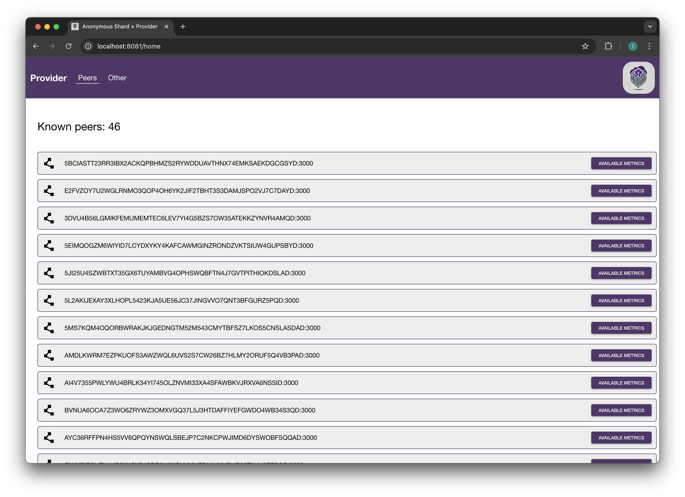
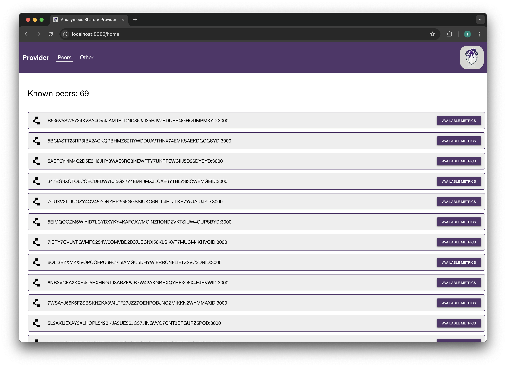
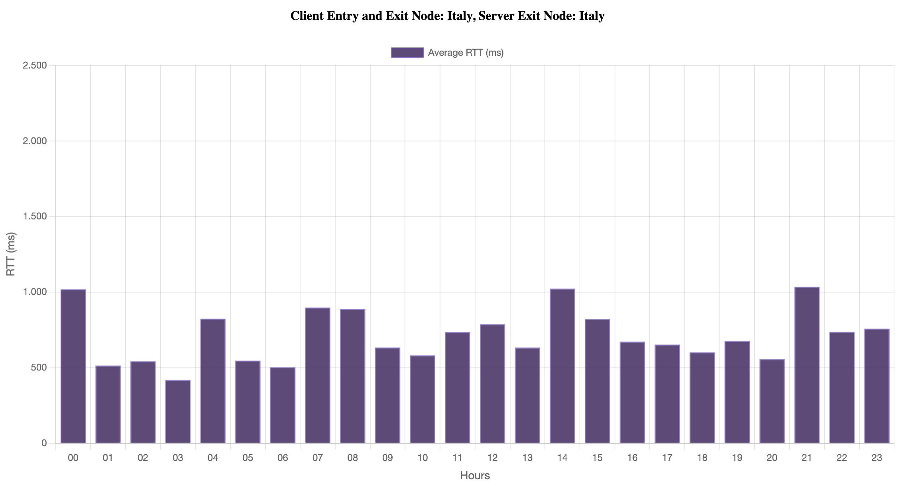
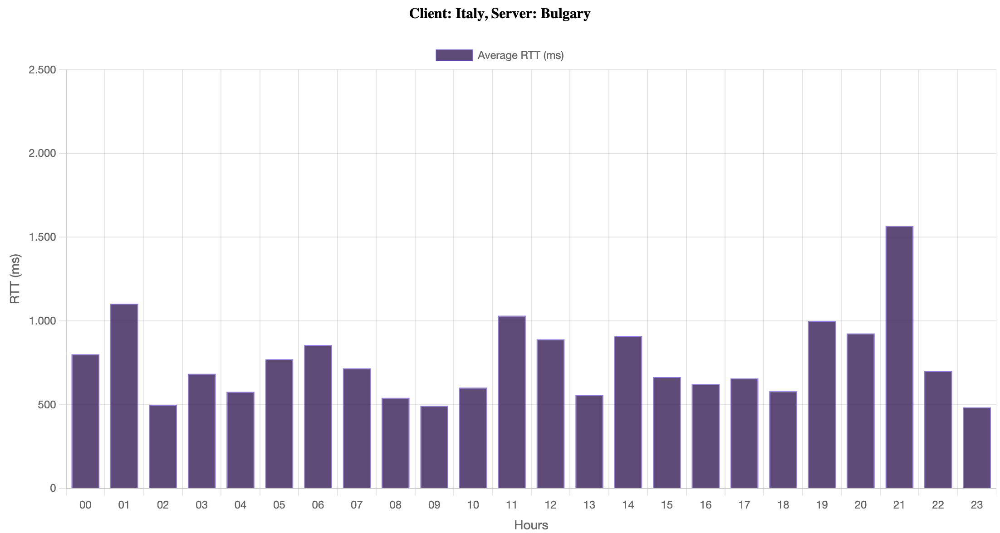
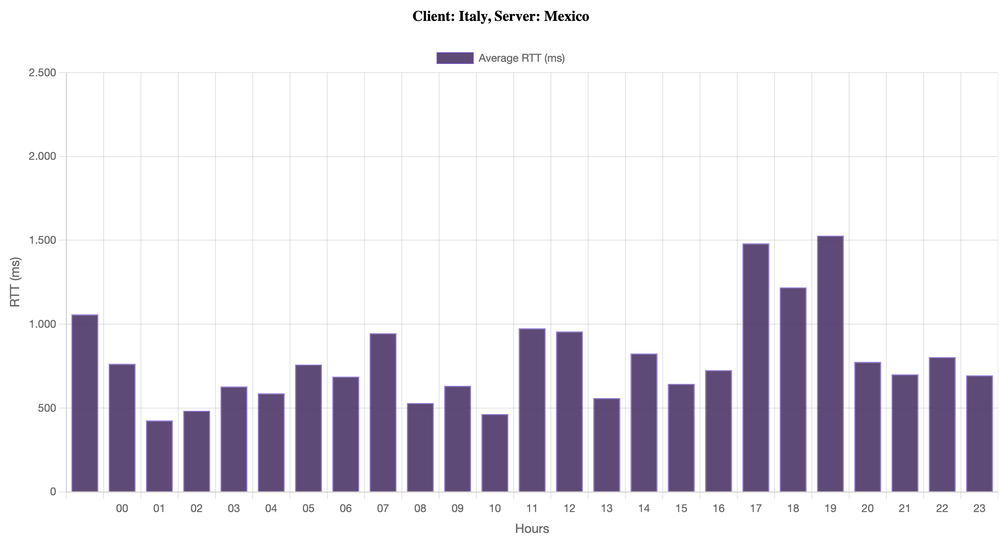
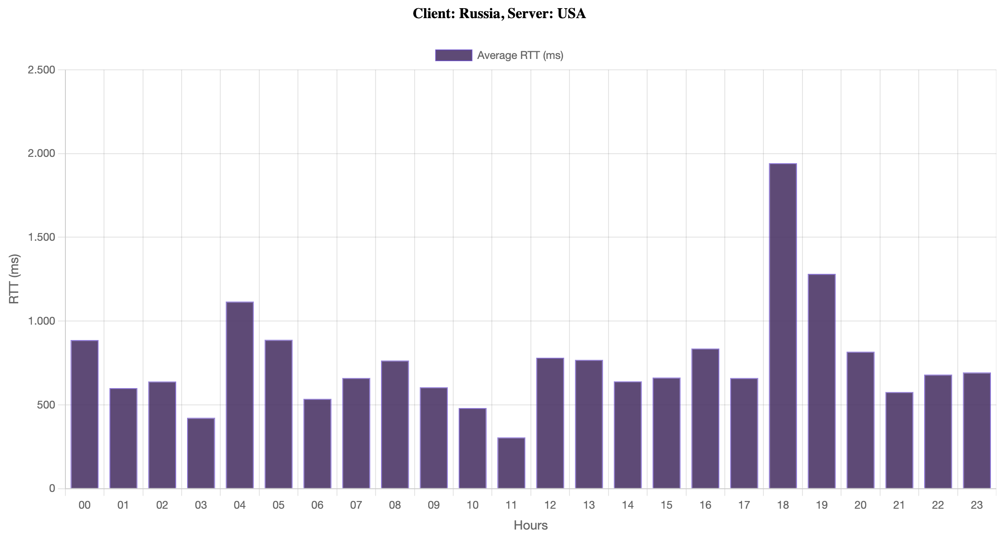
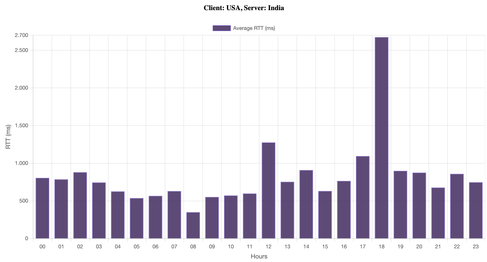
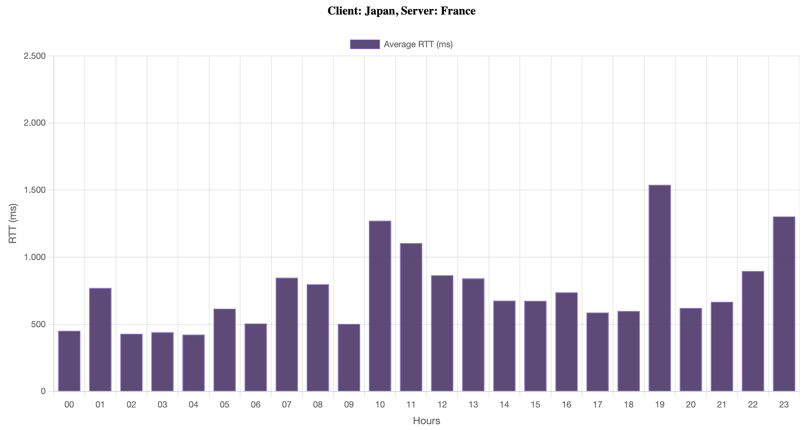

# Testing and Evaluation

In this chapter, the tests conducted on the system and the metrics used to evaluate its performance are analyzed.  
The system has been tested under different configurations to assess various scenarios.

For the first prototype, the tests are mainly focused on evaluating the system's functionalities.  
In contrast, the second prototype is designed specifically to assess the performance of the Tor network in terms of
latency.  
More importantly, the second prototype was developed to make general measurements on the Tor network; in this case, the
following presented measurements are used to understand how the first prototype can behave.

Specifically, the tests aim to determine the effectiveness of the system's scalability, identify potential improvements,
or evaluate additional components to handle a large number of nodes.  
More generally, the goal is to assess the feasibility or understand the areas that need further development.

Multiple scalability scenarios have been tested, ranging from a small number of nodes to a large-scale network to
observe system behavior in different conditions.

Other tests have been conducted to measure the Round Trip Time (RTT) between nodes in the network.  
This factor can have a significant impact on message delivery and task execution time, specifically within the Tor
network.  
Knowing this value is crucial for evaluating system performance since every operation possibly involves multiple nodes.

Furthermore, all tests are conducted in **anonymous mode**, as performing tests in a non-anonymous mode would not
provide meaningful insights given the nature of the system.

More efforts can be made to enhance and refine this evaluation phase as discussed in the Limitations Section and in the
Future Test Extensions Section.

## Scalability Test

This test aims to evaluate how the system behaves as the number of nodes increases.  
The primary focus is to determine the scalability of the network and assess whether an efficient discovery algorithm,
such as Kademlia, enables effective scaling.  
The discovery (explained in the Discovery Mechanism section) and task processing mechanism have been verified for
networks of up to 100 producer nodes and 30 consumer nodes on the same machine.  
The number of submitted task requests was set to 200, and the system was able to handle them without any issues.

A key factor influencing system performance is the tuning of specific parameters.  
Specifically, since the discovery mechanism uses a hash table, the number of nodes each node can store in its routing
table is one of them.  
This parameter is crucial as it directly impacts the number of hops a message must take to reach its destination.  
Additionally, it affects the time required for node discovery and the overall network stability.

To analyze these effects, the routing table bucket size has been varied from 10 to 70 nodes, observing the system's
behavior under different configurations.  
A frontend view from the point of the *Producers* can be seen in Figure 1 and Figure 2 where different bucket sizes have
been tested.

Another critical aspect that emerged from this test is the importance of the **Metric-Sharing interval**, which
determines how frequently nodes exchange resource metrics.  
This parameter represents a trade-off:

1. If the interval is too long, metric propagation slows down, potentially delaying decision-making and task execution.
2. If the interval is too short, the network may become flooded with messages, leading to unnecessary overhead.

A high Metric-Sharing interval can degrade system performance by increasing task execution times and reducing overall
efficiency.  
As discussed in previous chapters, the component responsible for evaluating task execution feasibility relies on
up-to-date resource metrics to make informed decisions.  
Since the current *Evaluator* logic is straightforward and selects the best node for execution based solely on available
metrics, outdated information may lead to suboptimal decisions.

The worst-case scenario occurs when the selected provider lacks updated knowledge.  
If this provider appears to have the best metrics for executing the task but the system is unaware of it, the task is
redirected to a suboptimal provider.  
This introduces a delay due to the need for task redirection, and since the new provider is not the most suitable,
additional execution delays occur.

Ultimately, network consistency is crucial: nodes must maintain an updated view of the system's state to ensure
efficient resource sharing.  
If metric propagation is too slow, task execution performance will suffer.  
To analyze the time needed for specific task execution and the time required to send a message to another node, a series
of tests analyzed in the Average RTT Test section were conducted.

Briefly, important aspects that only regard the network are:

1. The number of nodes in the network.
2. The physical distance between nodes.
3. The number of hops a message must traverse to reach its destination.

Other problems can arise from the execution of the task itself, but in this case, where the system is tested in a
controlled environment and the tasks were simple, the focus was on the network itself.

### Encountered Problems

No significant problems were encountered during the scalability tests, as the system was able to handle a large number
of nodes efficiently,  
but some considerations regarding the latency introduced by the Tor network need to be made.  
The network latency is not a problem of the system itself, and as mentioned, this network is designed to provide
anonymity by routing messages through multiple relays (adding encryption layers), so this behavior is expected.  
However, it poses a challenge for our system, as it increases the time required for message delivery.

One key observation is that, due to the way the Tor network operates, a new circuit is needed when the previous one is
closed due to expiration, inactivity, or other problems.  
The creation and switching of circuits contribute to the overall latency.  
This is something to consider when evaluating system performance, as it can introduce significant delays in task
execution.  
In particular, it could justify cases in which, apparently for no reason, the task execution time is higher than
expected.

In this case and in general, if some messages fail to be delivered, or something happens in the network, the retry
mechanism is triggered and the communication is re-established.  
This mechanism is essential to ensure the system's robustness and reliability, as it allows the system to recover from
errors and continue functioning correctly.  
The interval of the retry mechanism is a parameter that can be tuned to balance performance and reliability, or it can
be multiplied by the number of retries to avoid network flooding.

Another secondary issue encountered is related to an implementation detail.  
As the network grows in size, nodes exchange larger packets about metrics or neighbors, as discussed in the Discovery
Mechanism section.  
These packets contain information about the node's neighbors, and when the network is large, they can become
fragmented.  
The problem, which has been promptly resolved, was related to the reconstruction of the packet at the destination node
when it was fragmented.  
This issue was solved by prefixing the packet length at the beginning of the packet, allowing the receiver to determine
when the packet was fully received and ready for processing.

The problem was only encountered when scalability tests were performed because before, the local network's neighbor
packet size was too small to encounter this problem.

Apart from these two issues, the tests were satisfactory because the system was able to handle a large number of nodes
and tasks efficiently.  
Also, in cases where nodes are manually turned off, the system was able to continue functioning correctly, demonstrating
its robustness.  
In this case, what could clearly be improved and analyzed is the behavior of the network when these nodes are
distributed worldwide.  
This is a problem that will be addressed in the future and discussed in the Future Test Extensions section.  
The average time for message delivery will be analyzed in the Detailed Analysis section.

  
*Figure 1: Bucket Size 50 reaching saturation*

  
*Figure 2: Bucket Size 70 saturated*

## Average RTT Test

A series of tests were conducted to measure the average Round Trip Time (RTT) between nodes in the network, with the
final goal of estimating possible message delivery time values when dealing with a real-world scenario. RTT is a
critical metric for evaluating system performance, as it directly impacts message delivery and task execution time. For
this test, the specially created *Analyzer* prototype was used.

### Process

In this experiment, *Entry* and *Exit* nodes were used to measure the time taken for a message to traverse the Tor
network. The Analyzer sends a message to the Entry node, which then forwards it to the Exit node. The total time taken
for the message to reach its destination and return is recorded. To get a quite accurate average RTT value, a set of 50
requests was repeated each hour of the day with a total of 1200 requests per configuration. The number of requests is a
tunable parameter that can be increased to have a more accurate average value if needed or if the experiment needs to be
repeated for any reason.

At the end of the process, the measurements were averaged per hour, and charts were generated to visualize the results
clearly and provide a comprehensive view. Moreover, the standard deviation was calculated to understand the variance in
RTT values and identify potential outliers or noteworthy time spans.

### Considerations

Before analyzing the results or taking a look at the configurations, it is essential to consider how the measurements
are obtained and the factors that can influence them. The tests have been conducted using a Dockerized environment,
where two containers simulated the client and the server respectively.

To better explain and understand the internal mechanisms, an example is examined. In the Russia-USA case, the client was
explicitly configured to use an entry node in Russia (*EntryNodes ru*) and an exit node in the United States (
*ExitNodes us*). The server was only configured to use an exit node in the United States (*ExitNodes us*). This
setup ensured that all traffic was routed through the specified locations.

Although both the client and the server have been hosted on a machine in Italy, which may introduce slight bias in the
results, this setup effectively simulates a controlled observer-based measurement; however, it does not fully replicate
a globally distributed scenario. Still, it offers valuable insights into Tor network performance across different
geographic configurations.

The experiment was repeated with different entry-exit node pairs across the various countries configurations.

The results revealed significant differences in RTT depending on the geographic distance between the nodes and the
specific countries involved, as expected. Circuits spanning longer distances generally exhibited higher latency, while
those confined to geographically closer nodes showed lower RTT values. Time-based variations also highlighted the impact
of network congestion, with peak latency periods aligning with high-traffic hours in certain regions.

### Specific Measurement Process

The total RTT consists of the time taken for a message to travel from the client to the server through the Tor network
and back, but as mentioned, the client and the server were hosted in Italy. So, the RTT is not a simple client-server
ping but involves a multistep process.

The measurement, keeping the example of the USA-Russia configuration, can be divided into three main phases:

#### Request

Steps involved from the client to reach the server through the Tor network.

1. **Client to Entry Node:** Italy → RU
2. **Entry Node to Relay Nodes:** RU → Relays
3. **Relay Nodes to Exit Node:** Relays → US
4. **Exit Node forwards to Server:** US → Italy

#### Response

In this phase, the response is sent back to the client via the same Tor path.

1. **Server forward through Exit Node:** Italy → US
2. **Exit Node to Relay Nodes:** US → Relays
3. **Relay Nodes to Entry Node:** Relays → RU
4. **Entry Node to Client:** RU → Italy

Note that Tor circuit routing time, relay selection, and forwarding are included in the measurements. Same for the relay
processing delay and network propagation delay between relays.

#### Other Latency Factors

Several other elements impact RTT measurements.

1. **Tor Network Congestion:** Congestion within the Tor network can introduce additional delays, particularly when
   relays become overloaded due to high traffic volume at specific times or on certain routes. Another contributing
   factor is the limited bandwidth of exit nodes, which can further slow down data transmission when handling large
   amounts of traffic.

2. **Operating System and Docker Overhead:** Although not directly related to the Tor network, system-level factors such
   as Docker container networking overhead and OS-related processing delays can contribute to additional latency. While
   these factors are generally minor, they should still be considered in performance evaluations.

Note that the Tor Circuit Setup Time is not included in the RTT measurements, as it is a separate factor that can vary
depending also on relay availability. This setup time can be a significant factor in countries where the Tor network is
either unavailable or rarely used, and some considerations about this phase can be found in the Encountered Problem
Section.

### Final RTT Computation

The total is the sum of all contributing factors.

T_Request = T_Client to Entry + T_Entry to Relays + T_Relays to Exit + T_Exit to Server

T_Response = T_Server to Exit + T_Exit to Relays + T_Relays to Entry + T_Entry to Client

RTT = T_Request + T_Response

Where each term includes network latency, encryption/decryption overhead, relay processing time, and congestion delays.

### Countries Configuration

These tests were conducted using different country configurations trying to evaluate the system's message delivery time
across various geographic locations.

1. **Italy-Italy:** This configuration serves as a baseline to understand the behavior of the system in a controlled
   environment. By testing within the same country, we can minimize the effects of network congestion and routing
   complexity, providing a reference to comparing other, more geographically spread configurations. In the following
   sections, this configuration will be called the basecase.

2. **Italy-Bulgaria:** The Italy-Bulgaria pair helps us analyze the impact of geographical distance and network
   congestion in the case of a longer, but still European, distance. This test will highlight how the system performs
   when routing through different countries within Europe, and how the performance changes as moving away from the
   baseline (Italy-Italy) configuration. What should be noted are timings similar to the basecase with a slight increase
   in the values due to the increased distance between the two countries.

3. **Italy-Mexico:** By introducing a significant transcontinental distance, the Italy-Mexico configuration will allow
   us to evaluate the system’s performance under different routing conditions. This test explores how the system behaves
   when traversing multiple international networks with potential bandwidth limitations and routing inefficiencies.

4. **Russia-USA:** A test spanning the continents of Europe and North America will evaluate the system's performance
   over long distances. The results will help assess the impact of both physical distance and network congestion, which
   could vary due to differing levels of infrastructure and routing mechanisms across countries.

5. **USA-India:** This configuration tests a long-distance route between North America and Asia, which often experiences
   significant network congestion due to the amount of traffic routed through these regions. The USA-India test will
   offer insights into how well the system handles latency and congestion in the context of transoceanic connections,
   often influenced by both infrastructural limitations and geopolitical factors.

6. **Japan-France:** A test between Japan and France evaluates intercontinental network performance between Asia and
   Europe. This route often involves different network backbones and potential bottlenecks. This configuration will help
   understand how the system copes with varying network performance influenced by different regional routing schemes.

Each tested country configuration is represented in the figures below in the Detailed Analysis Section, where the average RTT for each location is displayed.

### Detailed Analysis

This section presents an analysis of the results obtained following the methodology described earlier. As introduced, a
chart for each country configuration is provided to offer a comprehensive view of network latency.

The analysis begins with the baseline configuration and gradually extends to other setups, depending on the geographic
distance covered by the tests. The baseline configuration refers to the scenario where the client, server, and both the
entry and exit nodes are located in Italy. This setup serves also as a reference for comparison, as it represents the
minimum latency in these tests.

**Figure 1:** illustrates the average RTT for the Italy-Italy configuration.

From the chart in **Figure 1**, it can be observed that the average RTT over time is approximately 710 ms, with a
standard deviation of 170 ms. The relatively low standard deviation indicates that the network remains fairly stable
throughout the day. However, as expected, there is a slight increase in RTT during the morning and evening, while the
lowest latency is recorded at night. The impact of the Tor network on RTT is clear from this baseline case.

A more interesting comparison emerges in the Italy-Bulgaria configuration, as shown in **Figure 2**. In this scenario the physical distance between the nodes increases.
Consequently, the average RTT rises to approximately 760 ms, with a standard deviation of 245 ms.

This result is noteworthy because, while an increase in RTT was expected due to the longer distance, the difference
remains moderate, as both countries are within Europe. Additionally, the standard deviation grows slightly more than the
RTT itself. This observation suggests that as the geographical distance increases and additional network routes are
involved, not only RTT rises, but the variability in network performance also increases. The growing standard deviation
indicates a degree of network instability over time, but it still remains within acceptable limits.

An even more significant variation is observed in the Italy-Mexico configuration in **Figure 3**. In this case, the
distance increases considerably, and the network infrastructure differs more significantly. The average RTT in this
setup is approximately 815 ms, with a standard deviation of about 300 ms. As expected, both RTT and standard deviation
increase with distance, confirming the correlation between geographical separation and network performance variability.

Examining all three charts, it becomes clear that between 05:00 PM and 07:00 PM, the RTT values are higher. This
pattern, unlike the European or intra-Italy measurements and averages, represents the peak hours during which network
congestion is more pronounced.

The Russia-USA configuration, shown in **Figure 4**, exhibits different results compared to the previous configurations.

An interesting aspect of this configuration is that the average RTT is approximately 820 ms, with a standard deviation
of 320 ms. More than the increase in RTT, which remains consistent with the expected latency increase due to the greater
distance between the nodes, what stands out is its similarity to the Italy-Mexico case. This similarity may be
attributed to various factors, particularly the choice of the circuit. Since Tor selects nodes based only on the
specified country, the actual nodes chosen in Russia and the USA significantly impact the results. A possible
explanation is that the Tor network does not select nodes randomly within a country but rather uses an algorithm that
balances multiple parameters, such as latency, network capacity, and load. In this case, despite the greater
geographical distance, the RTT values are similar to those in the Italy-Mexico configuration, highlighting the crucial
role of circuit selection.

Additionally, this result suggests that, due to the high availability of nodes in the USA, the network includes
significantly more high-performance nodes compared to Mexico. This is clear from the current number of available relays:
9 in Mexico of which only one Entry (or Guard) and one Exit versus the USA where there are a total of almost 1700
relays [According to Tor Metrics website at the time of testing].

Finally, the **USA-India** configuration, shown in **Figure 5**, examines a transoceanic connection between North
America and Asia. The RTT here reflects the larger physical distance and more pronounced network congestion.

### USA-India Configuration

The USA-India configuration, shown in Figure, shows an even more pronounced increase in
RTT compared to the previous configurations. In this case, the measurements aim to analyze how the network handles
transoceanic traffic routing and to assess whether infrastructural limitations or other factors influence performance.
The average RTT is approximately 850 ms, with a standard deviation of 440 ms.

A notable aspect of this configuration is the significant peak in RTT values, which exceed 2500 ms around 06:00 PM\@.
The difference between this time period and other hours is significant. Further investigation could help determine
whether this peak is an isolated event or a recurring pattern. Conducting measurements over weeks or months would
provide insights into whether this behavior is consistent or specific to that particular day.

Aside from this peak, the measurements are generally consistent with the expected increase in RTT due to the increased
distance between the nodes. However, the high standard deviation, over 400 ms, indicates significant variability in
network performance. While this value is influenced by the extreme peak observed, it remains a noteworthy finding in
itself.

The measurement about the Japan-France configuration has been done to evaluate the system over intercontinental network
performance between Europe and Asia. The average RTT is approximately 740 ms, with a standard deviation of 290 ms, as
as shown in Figure. The results are consistent and no bottlenecks, but three possible
peaks that reached the maximum of about 1500 ms are noted. They are isolated, so they can be considered situations in
which the network was a little bit more congested but, like in the USA-India configurations, further investigation could
help determine whether these peaks are recurring patterns or not.

In summary, these tests provide valuable insights into the system's performance across different geographic
configurations. The results highlight the impact of physical distance, network congestion, and circuit selection on
network latency. Moreover, the standard deviation values offer insights into network stability and variability over
time.

The prototype is available in this [GitHub repository](https://github.com/paga16-hash/tor-net-analyzer), and the
configuration file can be easily modified to include new countries or to change the entry and exit nodes. A list of
available relays available in different countries and interesting metrics can be found in
the [Tor Metrics](https://hackertarget.com/tor-exit-node-visualization/) website.

### Encountered Problems

One of the first issues encountered during this phase was the time required for the Tor network's bootstrap process.
Initially, I assumed this was influenced by the choice of entry or exit nodes, as the Tor network could also have no
running relays in the specified country. So, selecting an entry or exit node in such locations could lead to long
bootstrap times, and in some cases, if the *UseStrictNodes 1* line is present in the *torrc* configuration file  
(This option forces Tor to use Entry or Exit node if set to 1, failing if no node is available), the bootstrap
process could fail. This occurred when there were no suitable entry or exit nodes available in the specified region,
preventing the bootstrap process from completing.

Another observed issue was the variation in bootstrap performance depending on the network environment. For instance,
when connecting from my home network, the process is completed quickly with valid entry and exit nodes. However, when
using the University network, the bootstrap process was noticeably slower. A possible explanation for this discrepancy
is that different ISPs have varying agreements with networks that route Tor traffic. Additionally, network policies may
prioritize certain types of traffic over others.

A potential solution to mitigate these issues is the use of **[Tor Bridges](https://bridges.torproject.org/)** to bypass
network-level throttling or censorship. Tor bridges are private, unlisted entry points into the Tor network that help
circumvent restrictions imposed by ISPs.

### Limitations

The limitations of this testing phase are primarily related to the controlled environment in which the tests were
conducted. The setup did not present some issues, in the sense that the tests were successfully completed. The primary
limitation is that the tests were conducted in a local environment deploying the client and server on the same machine.
Measuring the round-trip time (RTT) between nodes in a real-world scenario, where nodes should be distributed globally,
would provide more accurate and relevant results. Additionally, in a real scenario, the locations of peers are not
known, meaning the RTT can vary significantly depending on the physical distance between nodes. The tests were conducted
in a controlled environment, and the results may not accurately reflect the exact system performance in a real-world
setting but can give an idea of how the system can behave with different configurations. Moreover, since the Tor network
is a shared network, the results are influenced by other users' activities and overall network congestion.

The task execution could be subject to redirection before execution and completion, introducing additional delays that
depend on the physical location of the new selected provider. This limitation can be addressed in future tests by
deploying instances worldwide to evaluate system performance in a real-world setting, and by completing the Kademlia
full discovery algorithm creating a way to represent coherently the distance between nodes.

Furthermore, to get significant results and generate charts representing the average RTT over time, the tests should be
conducted over an extended period (e.g., several months) to calculate a more accurate average RTT over really worldwide
distributed nodes. In particular, a subset of nodes could execute these tests continuously to provide a more
comprehensive view of network latency and performance at each task submission.

An additional factor that could affect the measurements in a real-world scenario is the limited number of Tor nodes in
certain countries. In this case, the bootstrap process could fail.

### Future Test Extensions

To improve the testing phase and get more comprehensive results, some extensions to the current methodology can be
considered. Moreover, the limitations encountered during the tests can be addressed by implementing additional features
and conducting more extensive evaluations. Additionally, metrics such as bandwidth and available relays can be
considered to assess the system's performance. Measuring other aspects of the network, such as Circuit Setup Time, can
also provide insights into network behavior under different configurations.

Beyond this approach, other improvements that can be explored:

1. **Mocking:** Mocking particular components of the system to simulate different conditions and evaluate system
   behavior under various scenarios. This approach could be a valuable tool for testing edge cases and assessing system
   robustness or to probe specific behaviors for feasibility checks.
2. **Real-World Scenario:** Setting up instances worldwide exploiting cloud services to analyze the system's performance
   in a truly distributed setting, allowing for realistic measurements and better insights.
3. **Network:** Evaluating the system's performance in various configurations, including fully connected networks,
   trying hierarchical structures (maybe more to adapt the system for other uses), and other sparse peer-to-peer
   topologies.
4. **Robustness:** Assessing the system's fault tolerance by simulating node failures, abrupt disconnections, and
   high-load scenarios. In this case, retry mechanisms and fault tolerance mechanisms have been tested manually to
   ensure that the system can recover from errors and continue functioning correctly, but a more structured approach is
   for sure beneficial.
5. **Security:** Simulating network attacks, such as Sybil Attacks and traffic correlation attempts, to evaluate the
   resilience of the system against potential threats.
6. **Optimization:** Testing and comparing different routing mechanisms to determine the most efficient strategy for
   task distribution and peer discovery, including the full Kademlia discovery algorithm.

By incorporating these extensions, the testing phase can be significantly improved, leading to more meaningful
performance evaluations.
