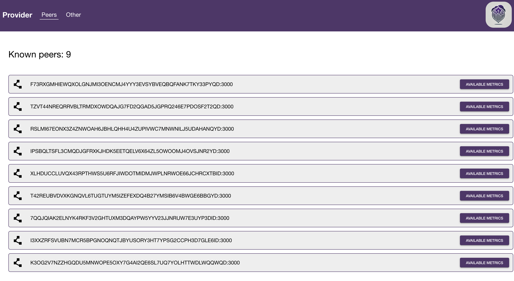
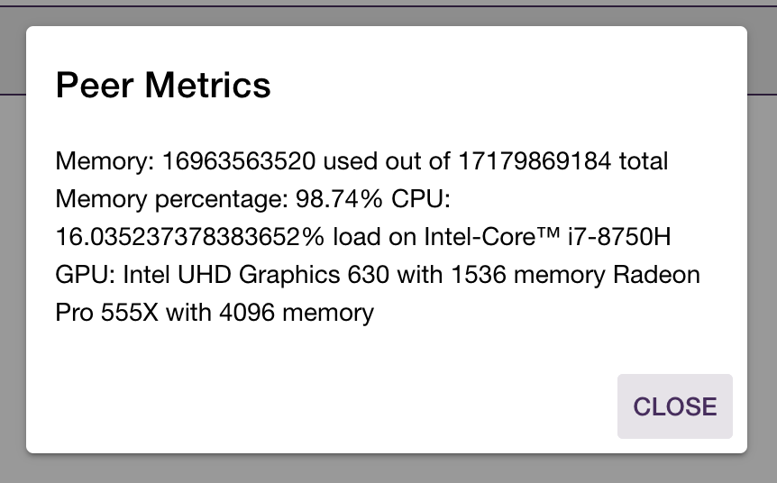
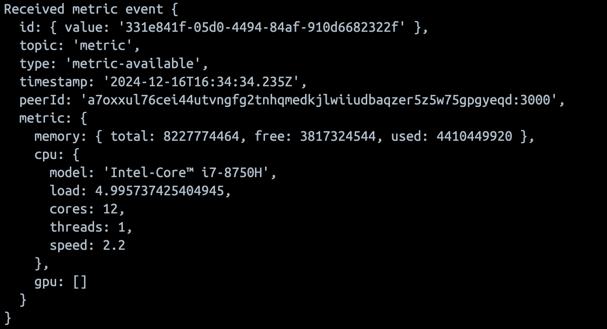
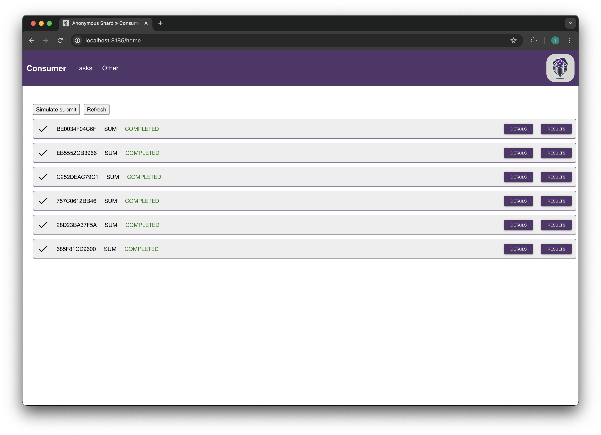
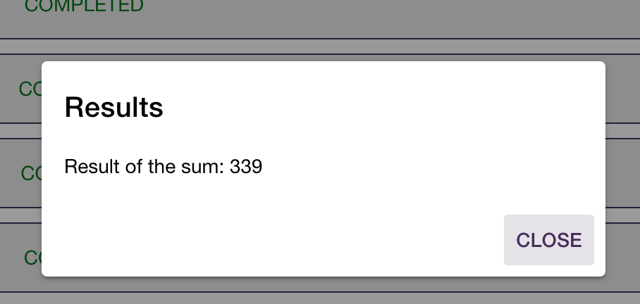

# Running System

This section provides only some screenshots of the system running, to give an idea of how the system works.

*Figure 1: Provider Node Dashboard*

*Figure 2: Provider Node Metric Consultation*

*Figure 3: Metric in the Backend*

*Figure 4: Consumer Node Dashboard*

*Figure 5: Pending Task in the Consumer Node*

*Figure 6: Sample Task Result in the Consumer Node*

## Author

- Alberto Paganelli ([paga16-hash](https://github.com/paga16-hash))